Added a cloned Flask application and created a Dockerfile for it.
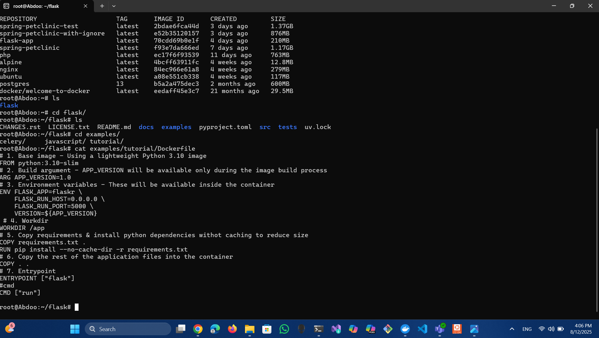

Ran the Flask app on port 5001.

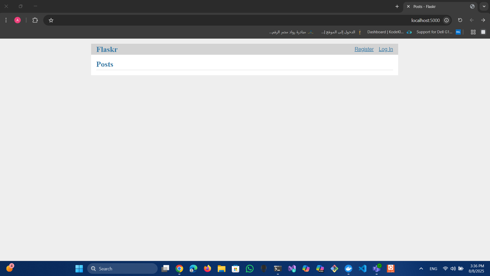

The registration page appeared when accessing /register.

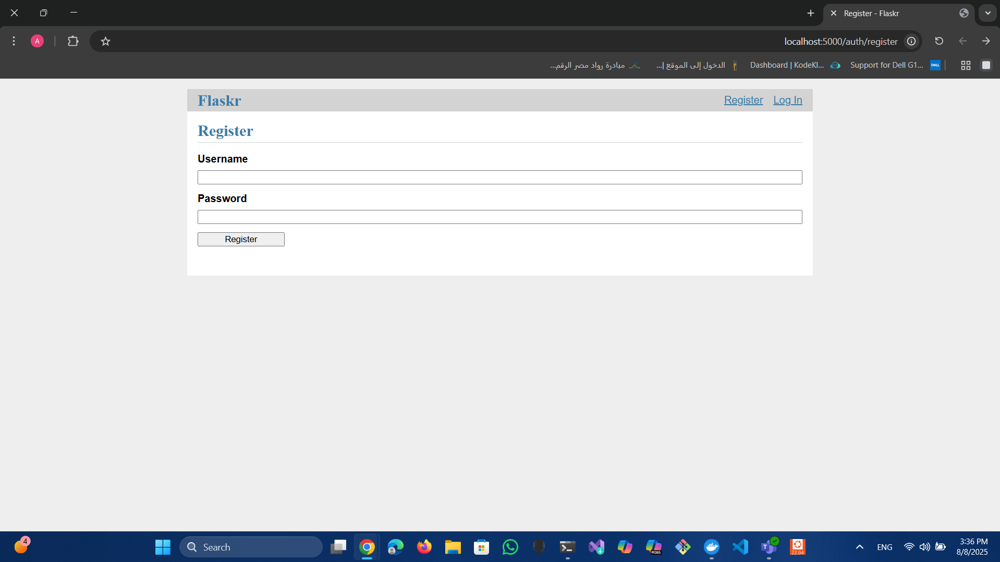

Created a Dockerfile for the Spring  application and displayed its contents.

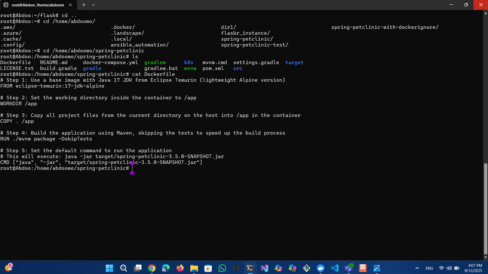
run the spring bet on port 5001

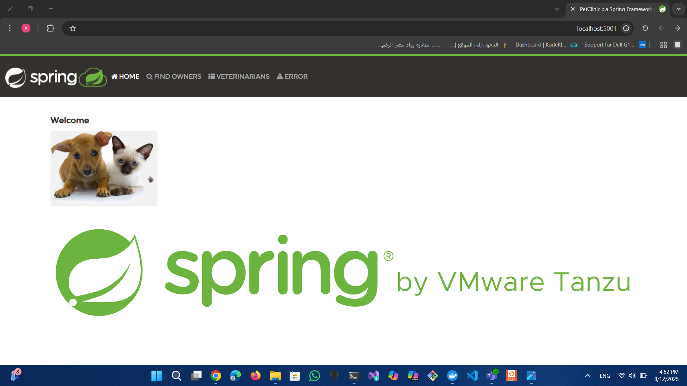

Cat .dockerignore 

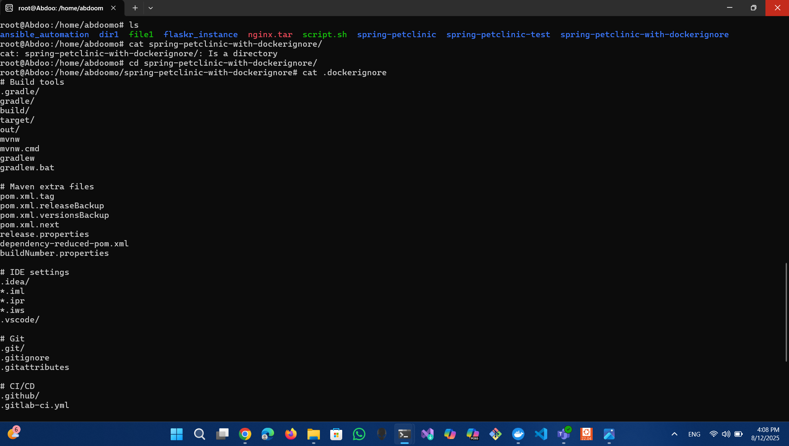

Run  docker ps to see spring and springwith ignore and the ports

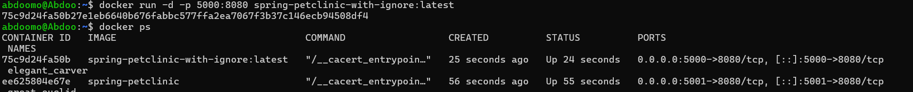

Accessed the Spring bit app with .dockerignore in the browser on port 5000

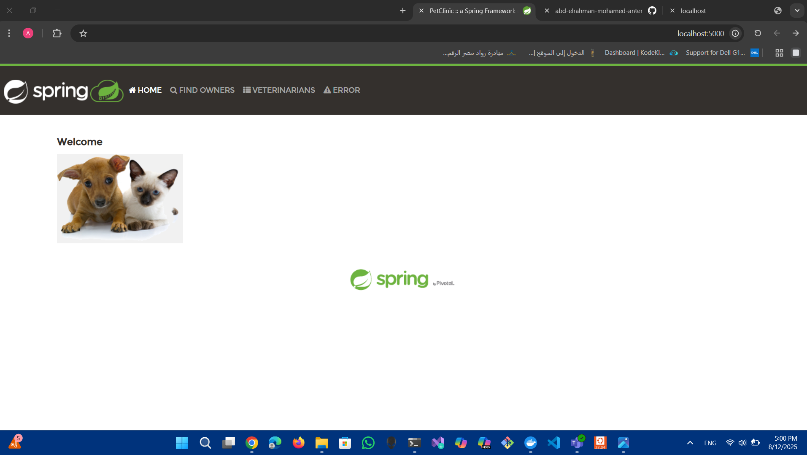

Compared image sizes with and without .dockerignore and found the size was reduced when using with ignore

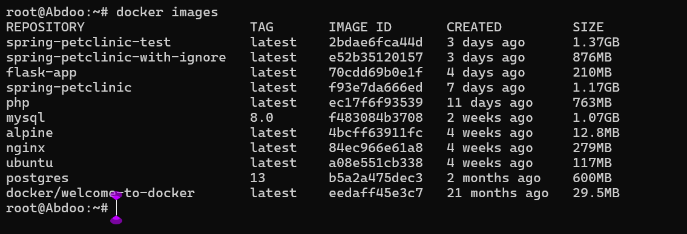

I made a new flask with a more dockerfile layers it is name is flask1 and cat the dockerfile
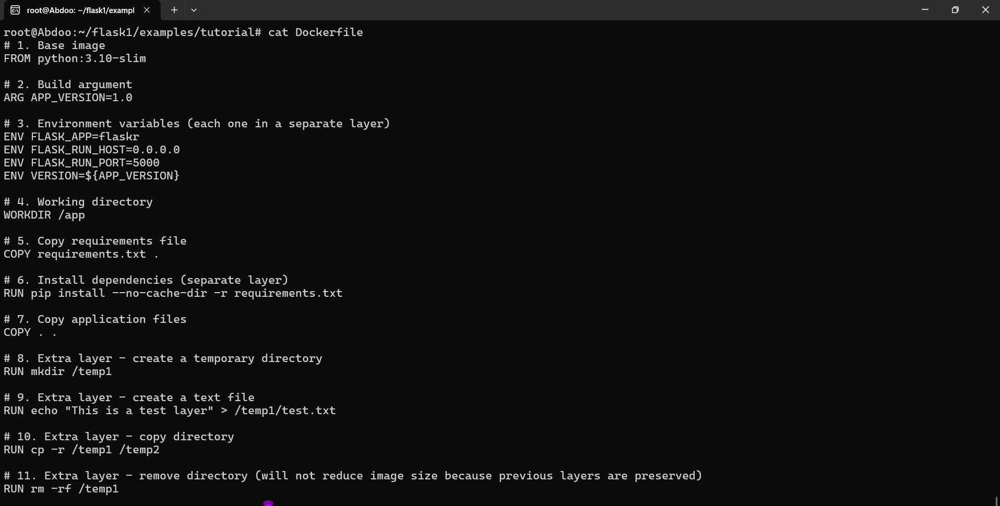

The rest of cat and the build command 
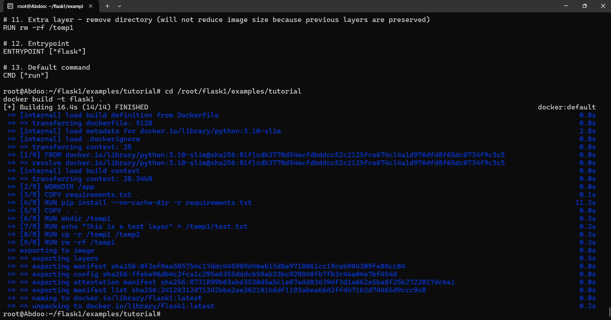

The size compare and they are the same !
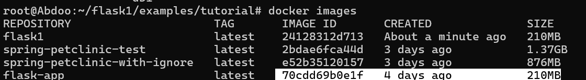

